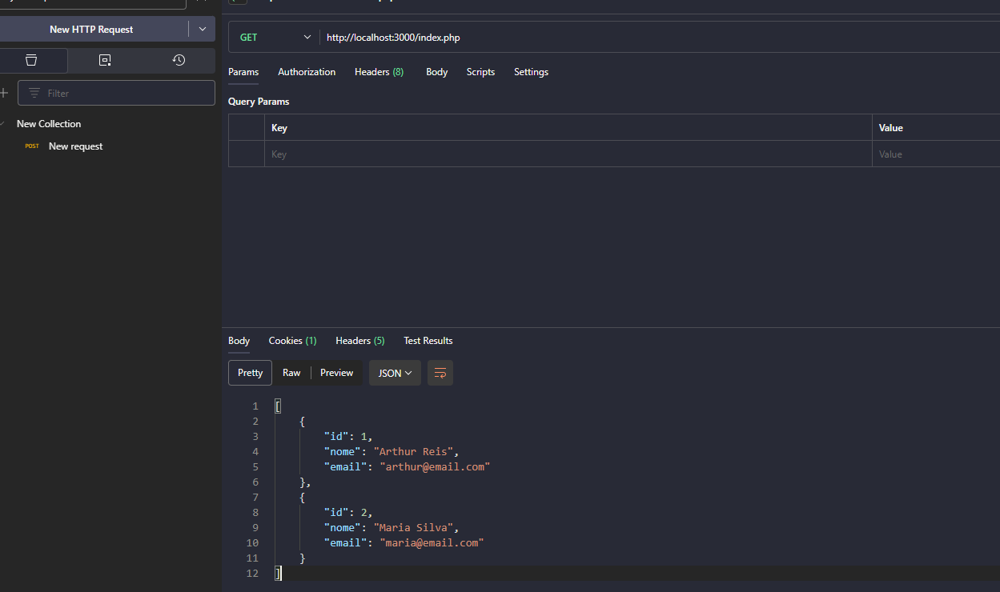

# 🚀 Minha Primeira API com PHP, Postman e MySQL no WSL
---

## 💡 Tecnologias utilizadas

  
  
  
  

---

Este projeto representa a **primeira API que eu desenvolvi** usando:

- 🐘 **PHP** para o backend
- 🧪 **Postman** para testar as requisições
- 🐬 **MySQL** rodando no **WSL (Ubuntu no Windows)** como banco de dados

Foi uma experiência muito legal de aprendizado, conectando o PHP com o banco via `mysqli`, testando com GET e POST pelo Postman, e organizando tudo via terminal no Linux (WSL).

---

## ✅ Funcionalidades

- [x] Conexão com banco de dados MySQL rodando no WSL
- [x] Testes de requisições com o Postman
- [x] Roteamento simples com `GET` e `POST`
- [x] Consulta de dados existentes na tabela

---

## 🧪 Testes com o Postman

Você pode testar as rotas usando o Postman:

- `GET` → `http://localhost/sua_rota.php`  
  (para visualizar os dados do banco)

- `POST` → `http://localhost/sua_rota.php`  
  (para enviar dados com body em JSON)

---

## 🖼️ Print da API funcionando

> 

---

## ✍️ Autor

Arthur Reis  
🚀 Desenvolvedor em evolução | Criador da ModupBox

---